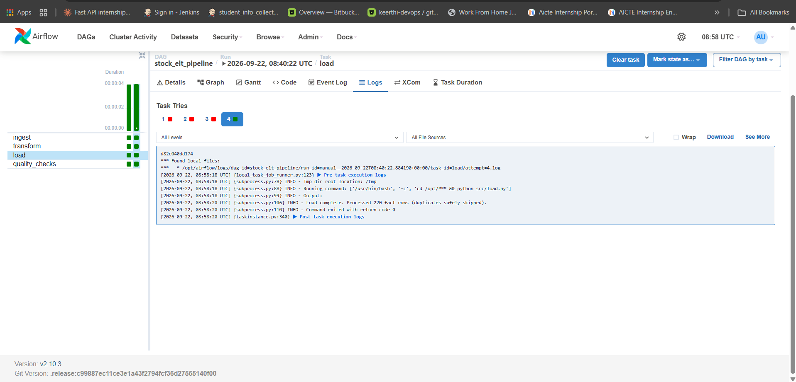
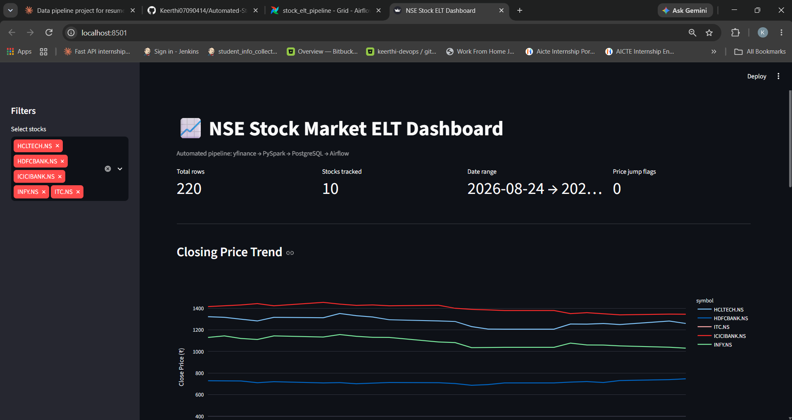
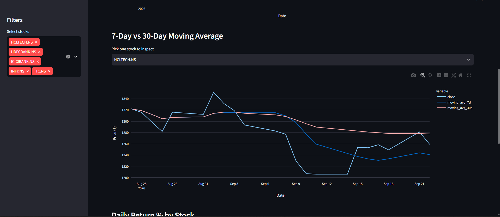

# 📈 Automated Stock Market ELT Pipeline

An end-to-end data engineering pipeline that ingests daily NSE stock data, transforms it with PySpark, loads it into a PostgreSQL star schema, orchestrates the whole flow with Apache Airflow, and visualizes it in an interactive Streamlit dashboard.

Built as a hands-on project to apply core data engineering concepts: ETL/ELT design, distributed data processing, workflow orchestration, containerization, and data quality validation.

---

## Architecture

```
yfinance API → ingest.py → Raw Parquet (data/raw)
       ↓
transform.py (PySpark)
       ↓
Processed Parquet (data/processed)
       ↓
load.py (SQLAlchemy)
       ↓
PostgreSQL (star schema: dim_stock, dim_date, fact_prices)
       ↓
quality_checks.py
       ↓
Streamlit + Plotly Dashboard

All steps orchestrated daily (weekdays, 6 PM IST) by an Apache Airflow DAG
running in Docker.
```

## Tech Stack

| Layer | Tools |
|---|---|
| Ingestion | Python, `yfinance` |
| Transformation | PySpark |
| Storage | PostgreSQL (star schema), Parquet |
| Orchestration | Apache Airflow (Docker) |
| Data Quality | Custom validation script (nulls, duplicates, price anomalies) |
| Visualization | Streamlit, Plotly |
| Infrastructure | Docker, Docker Compose |

## Features

- **Automated daily ingestion** of OHLCV data for 10 major NSE stocks via `yfinance`
- **PySpark transformations**: daily returns, 7-day and 30-day moving averages, 7-day volatility, abnormal price-jump flagging
- **Idempotent loading** into a PostgreSQL star schema (`fact_prices`, `dim_stock`, `dim_date`) using staging tables + `ON CONFLICT DO NOTHING`, so re-runs never fail on duplicates
- **Data quality checks**: null detection, duplicate detection, invalid price detection, anomaly flagging
- **Airflow DAG** with retries and scheduled runs, fully containerized alongside its own metadata database
- **Interactive dashboard** with stock filters, price trend charts, moving average comparisons, and return distribution analysis

## Screenshots

**Airflow — full pipeline run succeeding**


**Dashboard — price trends and metrics**


**Dashboard — moving averages**


## Project Structure

```
├── dags/
│   └── stock_pipeline_dag.py       # Airflow DAG definition
├── src/
│   ├── ingest.py                   # Pulls raw data from yfinance
│   ├── transform.py                # PySpark cleaning + feature engineering
│   ├── load.py                     # Loads into PostgreSQL star schema
│   └── quality_checks.py           # Data validation
├── sql/
│   └── create_tables.sql           # Star schema DDL
├── dashboard.py                    # Streamlit dashboard
├── docker-compose.yml              # PostgreSQL (application database)
├── docker-compose-airflow.yml      # Airflow + its metadata database
├── Dockerfile.airflow              # Custom Airflow image (adds Java + PySpark)
├── requirements.txt                # Local Python dependencies
└── requirements-airflow.txt        # Dependencies for the Airflow container
```

## Running Locally

**Prerequisites:** Python 3.10+, Java 17, Docker Desktop

1. Clone the repo and set up a virtual environment:
   ```
   python -m venv venv
   source venv/Scripts/activate   # Windows (Git Bash)
   pip install -r requirements.txt
   ```

2. Start the application database:
   ```
   docker compose up -d
   ```

3. Run the pipeline manually, step by step:
   ```
   python src/ingest.py
   python src/transform.py
   python src/load.py
   python src/quality_checks.py
   ```

4. Launch the dashboard:
   ```
   streamlit run dashboard.py
   ```

5. (Optional) Run the full pipeline through Airflow instead:
   ```
   docker compose -f docker-compose-airflow.yml up -d --build
   ```
   Airflow UI available at `http://localhost:8081`.

## Data Source & Disclaimer

Stock data is pulled via [`yfinance`](https://github.com/ranaroussi/yfinance), an open-source wrapper around Yahoo! Finance's public API. This project is for educational and portfolio purposes only — not intended for trading or investment decisions.

## Author

**Keerthi Priyanka Maddula**
BCA Student, KL University | Aspiring Data Engineer
[GitHub](https://github.com/Keerthi07090414)
